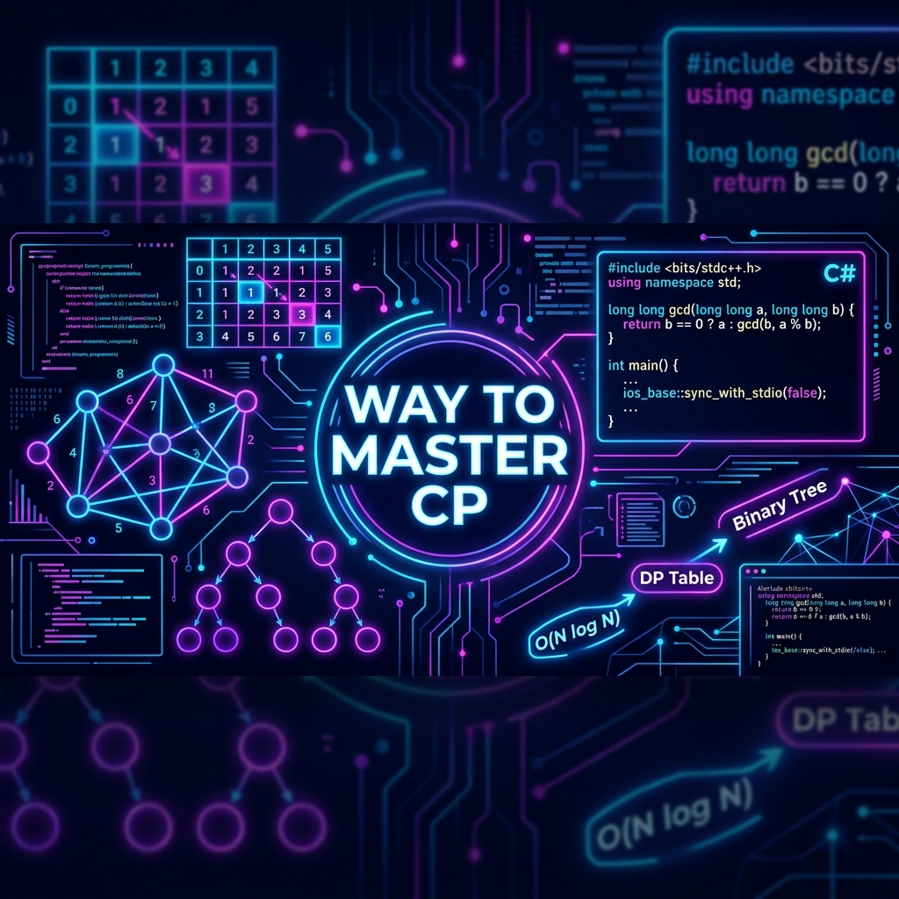
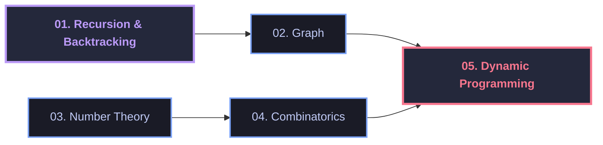

# 🚀 Way to Master CP (Competitive Programming)

<table align="center" border="0" cellpadding="10" cellspacing="0" width="100%">
  <tr>
    <td width="60%" valign="top" style="border: none;">
      <p>
        Welcome to the ultimate <strong>Way to Master CP</strong> roadmap and solution archive! 
        This repository tracks my journey in solving challenging problems on <strong>Codeforces</strong> and <strong>VJudge</strong> using <strong>C#</strong>. 
      </p>
      <p>
        🎯 <strong>Goal:</strong> Master core algorithms, advanced data structures, and mathematical concepts required for competitive programming and high-performance problem solving.
      </p>
      <h3>🔗 Connect & Follow</h3>
      <ul>
        <li>
          <strong>Codeforces:</strong> 
          <a href="https://codeforces.com/profile/__PoP__">__PoP__</a>
        </li>
        <li>
          <strong>VJudge:</strong> 
          <a href="https://vjudge.net/user/uncle_pop">uncle_pop</a>
        </li>
        <li>
          <strong>LinkedIn:</strong> 
          <a href="https://www.linkedin.com/in/abanoub-saweris/">abanoub-saweris</a>
        </li>
        <li>
          <strong>Email:</strong> 
          <a href="mailto:abanoub.saweris02@gmail.com">abanoub.saweris02@gmail.com</a>
        </li>
        <li>
          <strong>Phone:</strong> 
          <code>+20 1274782728</code>
        </li>
      </ul>
    </td>
    <td width="40%" valign="top" style="border: none;">
      
    </td>
  </tr>
</table>

---

## 🗺️ Topic Progression Roadmap

Here is the learning path and relationship between the topics covered in this repository:



---

## 📚 Curriculum & Track Structure

Rather than packing all sheets and contests in this main README, the repository is organized hierarchically. Each topic folder contains its own localized documentation, and every problem is fully self-documented.

### Directory Structure Layout

Here is how the directory structure is organized:

```text
src/
├── 01-RecursionAndBacktracking/
│   ├── README.md               <-- Main topic overview, sheets list & links
│   └── Sheet_01/               <-- Folder for a specific sheet/practice
│       └── Problem_A/          <-- Folder for a specific problem
│           ├── Solution.cs     <-- C# Solution Code
│           └── README.md       <-- Problem statement link & solution explanation
│
├── 02-Graph/
│   ├── README.md
│   ...
```

### Track Overview

| Target Folder                                                          | Description                                                                                 |
| :--------------------------------------------------------------------- | :------------------------------------------------------------------------------------------ |
| 📁 **[01-RecursionAndBacktracking](src/01-RecursionAndBacktracking/)** | Recursion, Backtracking & Search space exploration.                                         |
| 📁 **[02-Graph](src/02-Graph/)**                                       | Graph Traversals (DFS, BFS), Shortest Paths (Dijkstra), MST, and Support helper structures. |
| 📁 **[03-NumberTheory](src/03-NumberTheory/)**                         | Primality testing, Sieve, GCD/LCM, Modular Arithmetic.                                      |
| 📁 **[04-Combinatorics](src/04-Combinatorics/)**                       | Permutations, Combinations, and Counting principles.                                        |
| 📁 **[05-DynamicProgramming](src/05-DynamicProgramming/)**             | Iterative & Recursive DP optimization techniques.                                           |

---

## 🛠️ Project Structure & C# Environment

This repository is configured as a standard `.NET 10` solution, allowing easy building, execution, and local debugging.

### Prerequisites

Ensure you have the **.NET SDK 10** installed:

- [Download .NET SDK](https://dotnet.microsoft.com/download)

### How to Run Solutions

1. Clone the repository:

   ```bash
   git clone https://github.com/AbanoubPhelopos/way-to-master-cp.git
   cd way-to-master-cp
   ```

2. Build the solution to restore dependencies:

   ```bash
   dotnet build
   ```

3. Run the solution runner project:
   ```bash
   dotnet run --project src/WayToMasterCP.csproj
   ```
