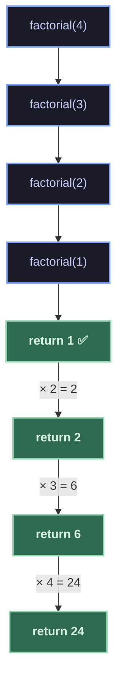
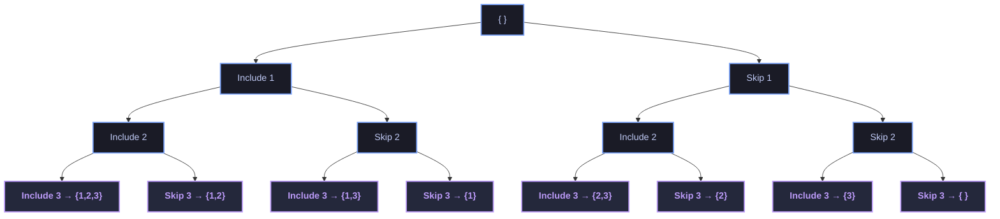
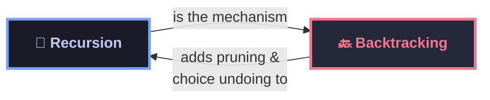

# 📁 01 — Recursion & Backtracking

This module covers the foundational techniques of **Recursion** and **Backtracking** — the building blocks for solving problems that involve exploring decision spaces, breaking problems into smaller subproblems, and systematically searching for solutions.

---

## 🔄 What is Recursion?

**Recursion** is a technique where a function calls itself to solve smaller instances of the same problem, until it reaches a **base case** that can be solved directly.

Every recursive solution has two essential parts:

| Part            | Role                                                     |
| :-------------- | :------------------------------------------------------- |
| **Base Case**   | The simplest instance — stops the recursion               |
| **Recursive Case** | Breaks the problem into a smaller subproblem and recurses |

### How Recursion Works — Call Stack

When a recursive function is called, each call is pushed onto the **call stack**. Once a base case is reached, the calls begin returning (unwinding) in reverse order.



### Example — Factorial

```csharp
static int Factorial(int n)
{
    if (n <= 1) return 1;       // Base case
    return n * Factorial(n - 1); // Recursive case
}
```

### Common Recursion Patterns

| Pattern                  | Description                                      | Example                    |
| :----------------------- | :----------------------------------------------- | :------------------------- |
| **Linear Recursion**     | One recursive call per level                     | Factorial, LinkedList walk |
| **Binary Recursion**     | Two recursive calls per level (binary tree)      | Fibonacci, Merge Sort      |
| **Multiple Recursion**   | More than two calls per level                    | Generating permutations    |
| **Tail Recursion**       | Recursive call is the last operation             | Optimizable by compilers   |

---

## 🔙 What is Backtracking?

**Backtracking** is a refined form of recursion used to solve **constraint satisfaction** and **combinatorial search** problems. It builds solutions incrementally, and **abandons (backtracks)** a path as soon as it determines that path cannot lead to a valid solution.

### The Core Idea

```
1. CHOOSE   → Make a choice (pick an option)
2. EXPLORE  → Recurse with that choice
3. UNCHOOSE → Undo the choice (backtrack) and try the next option
```

### Decision Tree — Backtracking with Pruning

Consider finding all subsets of `{1, 2, 3}`. At each element, we decide: **include it** or **skip it**. Backtracking explores this tree, pruning invalid branches early.



### Backtracking Template

```csharp
static void Backtrack(List<int> current, int start, int[] options)
{
    // Process or record the current solution
    ProcessSolution(current);

    for (int i = start; i < options.Length; i++)
    {
        // 1. CHOOSE
        current.Add(options[i]);

        // 2. EXPLORE
        Backtrack(current, i + 1, options);

        // 3. UNCHOOSE (backtrack)
        current.RemoveAt(current.Count - 1);
    }
}
```

---

## 🔄 vs 🔙 Recursion vs Backtracking



| Aspect           | Recursion                          | Backtracking                            |
| :--------------- | :--------------------------------- | :-------------------------------------- |
| **Purpose**      | Solve subproblems                  | Search for valid configurations         |
| **Exploration**  | Explores all subproblems           | Prunes invalid branches early           |
| **State**        | Usually implicit (parameters)      | Explicit (choose → explore → unchoose)  |
| **When to use**  | Problem decomposes naturally       | Need to find/count valid arrangements   |

---

## 📂 Sheets & Practice

| Sheet                                                | Description                     |
| :--------------------------------------------------- | :------------------------------ |
| 📁 [acm-level-2-sheet](acm-level-2-sheet/)          | ACM Level 2 practice problems   |
