# 📈 Longest Increasing Subsequence

| Info             | Details                                                 |
| :--------------- | :------------------------------------------------------ |
| **Problem Link** | Classic LIS Problem                                    |
| **Topic**        | Recursion & Dynamic Programming                        |
| **Difficulty**   | 1000                                                   |

---

## 📝 Problem Summary

Given a list `A` of `N` numbers, find the length of the **Longest Increasing Subsequence (LIS)**.

An increasing subsequence is a set of indices `{i₀, i₁, i₂, ..., iₖ}` such that:
- `0 <= i₀ < i₁ < i₂ < ... < iₖ < N`
- `A[i₀] < A[i₁] < A[i₂] < ... < A[iₖ]`

The LIS is the subsequence with the **maximum length `k + 1`**.

---

## 💡 Approach & Intuition

### Key Observation

At each index, we have **two choices**:
1. **Skip** the current element — subsequence length stays the same
2. **Take** the current element — only if it's greater than the previously taken element

This naturally forms a **binary recursion tree** where each node branches based on take/skip decisions.

### Recursion Tree Example

For the list `{1, 4, 2, 4, 3}`:

```mermaid
graph TD
    classDef found fill:#2d6a4f,stroke:#95d5b2,stroke-width:2px,color:#d8f3dc,font-weight:bold
    classDef normal fill:#1a1b26,stroke:#7aa2f7,stroke-width:2px,color:#c0caf5
    classDef take fill:#6c1d1d,stroke:#e76f6f,stroke-width:2px,color:#ffdada

    A["(idx=0, prev=-1, val=-)"]:::normal
    B["(idx=1, prev=0, val=1)"]:::normal
    C["(idx=1, prev=-1, val=-)"]:::normal
    D["(idx=2, prev=1, val=4)"]:::normal
    E["(idx=2, prev=0, val=1)"]:::normal
    F["(idx=2, prev=1, val=4)"]:::normal
    G["(idx=2, prev=-1, val=-)"]:::normal
    H["(idx=3, prev=2, val=2)"]:::normal
    I["(idx=3, prev=1, val=4)"]:::normal

    A -->|"take 1"| B
    A -->|"leave"| C
    B -->|"take 4"| D
    B -->|"leave"| E
    C -->|"take 4"| F
    C -->|"leave"| G
    D -->|"take 2"| H
    D -->|"leave"| I

    style A fill:#1a1b26
    style H fill:#2d6a4f
    style I fill:#2d6a4f
```



The highlighted nodes represent valid **increasing subsequences** found during recursion.

### Base Cases

| Condition                    | Result    | Reason                                      |
| :--------------------------- | :-------- | :------------------------------------------ |
| `index >= N`                 | **0**     | Reached end of array — no more elements     |
| `prev == -1`                 | Can take  | No previous element — any element is valid  |
| `arr[index] > arr[prev]`     | Can take  | Current element continues the increasing seq|
| otherwise                    | Cannot take | Breaks the increasing property             |

### Recursive Formula

```
LIS(index, prev_index) =
    0,                                           if index >= N
    max(
        1 + LIS(index + 1, index),               // take current
        LIS(index + 1, prev_index)               // leave current
    ),                                           if prev == -1 OR arr[index] > arr[prev]
    LIS(index + 1, prev_index),                  // must leave (can't take)
    otherwise
```

---

## ⏱️ Complexity Analysis

- **Time:** `O(2ⁿ)` — at each position we branch into two paths (worst case explores all subsets)
- **Space:** `O(n)` — recursion stack depth of at most `n`

---

## 🔑 Key Takeaway

This problem demonstrates **recursion as systematic enumeration**. The two-choice (take/leave) pattern is a fundamental recursion technique. While this exponential solution is conceptually clean, optimized DP solutions can achieve `O(n log n)` using binary search — but the recursive approach is excellent for understanding the underlying structure of subsequences.

---

## 📊 Problem Extension

Try optimizing this to `O(n log n)` using:
1. **Patience Sorting** — maintain tails of smallest ending elements
2. **Binary Search** — for each element, find the leftmost tail that's >= current element