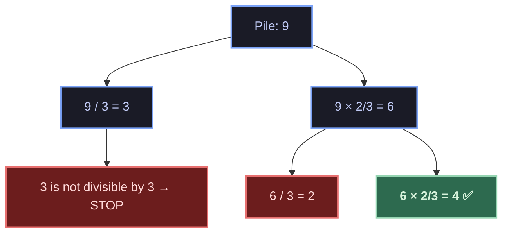

# 🏆 Gold Rush

| Info             | Details                                                                     |
| :--------------- | :-------------------------------------------------------------------------- |
| **Problem Link** | [Codeforces 2035A - Gold Rush](https://codeforces.com/contest/1829/problem/D) |
| **Topic**        | Recursion                                                                   |
| **Difficulty**   | 1000                                                                         |

---

## 📝 Problem Summary

You start with a single pile of **n** gold nuggets. In one operation you may pick any pile and split it into two piles where one pile has **exactly twice** as many nuggets as the other (the original pile must be divisible by 3).

**Question:** Can you end up with a pile of exactly **m** nuggets after zero or more operations?

---

## 💡 Approach & Intuition

### Key Observation

When you split a pile of size `n` into two parts where one is twice the other:

- Smaller part = `n / 3`
- Larger part = `2n / 3`

This is only valid when `n` is divisible by 3. The problem becomes a **recursive tree search**: starting from the root pile `n`, at each node we branch into two children (`n/3` and `2n/3`), and we check if any node in the tree equals `m`.

### Recursion Tree Example

For `n = 9, m = 4`:



We find `4` in the tree → answer is **YES**.

### Base Cases & Pruning

| Condition       | Result  | Reason                                             |
| :-------------- | :------ | :------------------------------------------------- |
| `n == m`        | **YES** | Already have the target pile                       |
| `n < m`         | **NO**  | Splitting can never create a pile larger than `n`  |
| `n % 3 != 0`   | **NO**  | Can't split — the pile isn't divisible by 3        |

### Recursive Formula

```
CanMake(n, m) =
    true,                                       if n == m
    false,                                      if n < m or n % 3 ≠ 0
    CanMake(n/3, m)  OR  CanMake(2n/3, m),      otherwise
```

---

## ⏱️ Complexity Analysis

- **Time:** `O(2^log₃(n))` — at each level, the pile shrinks by a factor of 3, giving at most `log₃(n)` levels. Each level branches into 2 paths. For `n ≤ 10⁷`, `log₃(10⁷) ≈ 15`, so the tree has at most `2¹⁵ = 32768` nodes — very fast.
- **Space:** `O(log₃(n))` — recursion stack depth.


---

## 🔑 Key Takeaway

This problem is a classic example of **recursion as tree search**. The trick is recognizing that splitting into "one part is twice the other" means dividing by 3, which naturally forms a binary recursion tree that's shallow enough (`~15` levels) to explore exhaustively without memoization.
