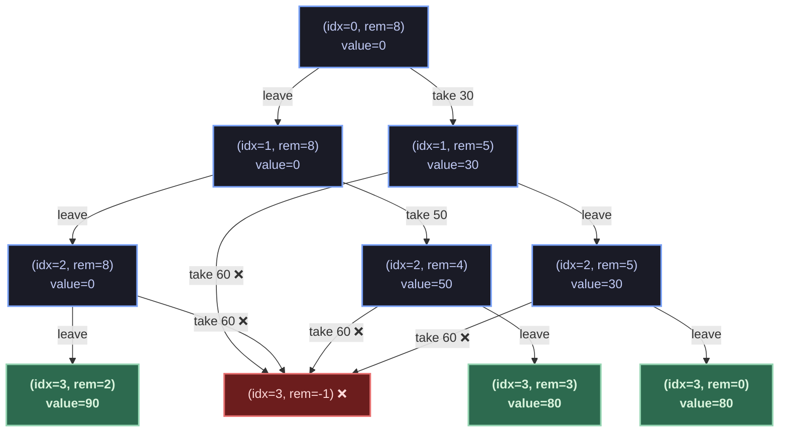

# 🎒 Practice: Knapsack

| Info             | Details                                                                 |
| :--------------- | :---------------------------------------------------------------------- |
| **Problem Link** | Classic 0/1 Knapsack Problem                                            |
| **Topic**        | Recursion                                                               |
| **Difficulty**   | --                                                                   |

---

## 📝 Problem Summary

Given `N` items, each with a **weight** `wᵢ` and **value** `vᵢ`, select items to fit in a knapsack of capacity `W`. Maximize the total value.

**Question:** What is the maximum possible sum of values that can be carried?

---

## 💡 Approach & Intuition

### Key Observation

At each item, we have **two choices**:
1. **Leave** the current item — value stays the same, weight unchanged
2. **Take** the current item — only if it fits in remaining capacity, value increases, capacity decreases

This is a **binary recursion tree** where each node branches on take/leave decisions.

### Recursion Tree Example

For `N=3, W=8` with items: `(w=3, v=30)`, `(w=4, v=50)`, `(w=5, v=60)`



**Result:** Max value = **90** (items 1 and 2: `30 + 50 + 10 unused capacity`)

### Base Cases & Pruning

| Condition                      | Result     | Reason                                      |
| :----------------------------- | :--------- | :------------------------------------------ |
| `index >= N`                   | **0**      | No more items to consider                   |
| `weight > remaining_capacity`  | **Prune**  | Item doesn't fit — can't take              |
| otherwise                     | Explore both paths |

### Recursive Formula

```
Knapsack(index, remaining_capacity) =
    0,                                              if index >= N
    Knapsack(index + 1, remaining_capacity),         if weight > remaining_capacity

    max(
        arr[index].value + Knapsack(index + 1, remaining_capacity - arr[index].weight),  // take
        Knapsack(index + 1, remaining_capacity)                                           // leave
    ),                                             otherwise
```

---

## ⏱️ Complexity Analysis

- **Time:** `O(2ⁿ)` — at each item we branch into two paths
- **Space:** `O(n)` — recursion stack depth

---

## 🔑 Key Takeaway

This is a **classic take/leave recursion pattern** applied to combinatorial optimization. The key insight is that we only take an item if it fits — otherwise we prune that branch. While this exponential solution is clean and educational, optimized DP solutions can achieve `O(n × W)` using tabulation.

---

## 📊 Problem Extension

Try optimizing using **Dynamic Programming**:
1. **2D DP** — `dp[i][w]` = max value using first `i` items with capacity `w`
2. **1D DP** — iterate capacity backwards to avoid reuse