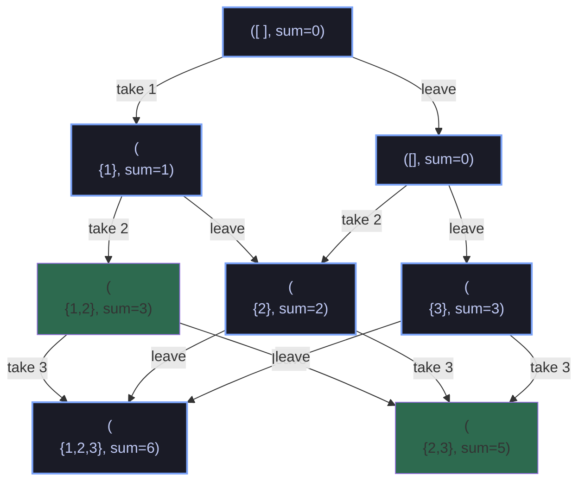
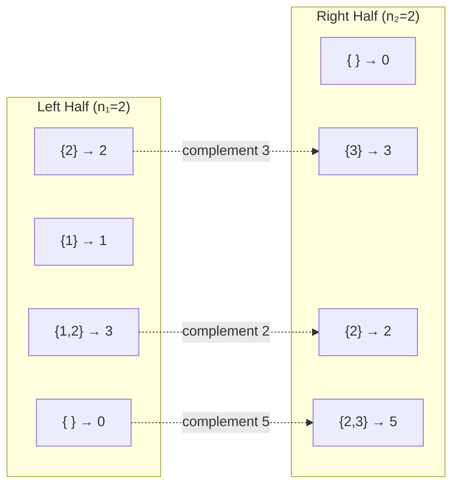

# 🔀 Meet in the Middle

| Info             | Details                                       |
| :--------------- | :-------------------------------------------- |
| **Problem Link** | [Meet-in-the-Middle](https://vjudge.net/contest/793439#problem/D)|
| **Topic**        | Recursion + Divide & Conquer                  |
| **Difficulty**   | --                                            |

---

## 📝 Problem Summary

Given an array of `n` numbers, count the number of ways to choose a **subset** whose sum equals `x`.

**Question:** How many subsets have sum exactly equal to `x`?

---

## 💡 Approach & Intuition

### Why Meet-in-the-Middle?

The constraint is `n ≤ 40` — too large for brute force (`2⁴⁰ ≈ 10¹²`), but small enough to split in half.

**Meet-in-the-middle strategy:**

1. Split the array into two halves (left: `n/2`, right: `n - n/2`)
2. Enumerate **all subset sums** for each half → `2^(n/2)` per half, which is `2^20 ≈ 10⁶` — feasible!
3. For each sum in the left half, count how many complementary sums in the right half add up to `x`

### Recursion Tree for Each Half

For each half, we recursively generate all subset sums using the **take/leave** pattern:



_Note: `{}` denotes subset and `sum=x` shows the current sum._

### Meet-in-the-Middle Combination

For `arr = [1, 2, 3, 2]` with `x = 5`:



**Counting pairs that sum to 5:**

- `0 + 5` → Left: `{}`, Right: `{2,3}`
- `2 + 3` → Left: `{2}`, Right: `{3}`
- `3 + 2` → Left: `{1,2}`, Right: `{2}`

**Total Ways = 3**

### Base Cases & Pruning

| Condition      | Action     | Reason                                        |
| :------------- | :--------- | :-------------------------------------------- |
| `index == end` | **Record** | Reached end of half — save current sum        |
| `sum > x`      | **Prune**  | (Optional optimization for early termination) |

### Key Formulas

```
GenerateAllSums(index, end, currentSum):
    if index == end:
        sums.add(currentSum)
        return
    GenerateAllSums(index + 1, end, currentSum)           // leave
    GenerateAllSums(index + 1, end, currentSum + arr[index]) // take

TotalWays = count of pairs (s₁, s₂) where s₁ + s₂ = x
           = Σ countMatching(rightSums, x - s₁) for all s₁ in leftSums
```

---

## ⏱️ Complexity Analysis

- **Generating sums:** `O(2^(n/2))` per half — `2^20 ≈ 10⁶` operations
- **Sorting:** `O(2^(n/2) × log(2^(n/2)))`
- **Counting pairs:** `O(2^(n/2))` lookups via binary search
- **Total Time:** `O(2^(n/2) × log(2^(n/2)))` ≈ `O(2^(n/2) × n/2)`
- **Space:** `O(2^(n/2))` to store all subset sums

---

## 🔑 Key Takeaway

**Meet-in-the-middle** transforms an impossible brute-force (`2⁴⁰`) into a feasible solution by splitting the problem in half. The key insight is that enumeration of subsets for `n/2` items is manageable (`2^20 ≈ 10⁶`), and combining two lists can be done efficiently with sorting and binary search.

---

## 📊 Problem Extension

Try these variants:

1. **Optimization:** If `tᵢ` and `x` are bounded integers, a direct DP array works
2. **Multiple test cases:** Process each independently
3. **Memory optimization:** Use HashSet instead of sorted list when counting exact matches
